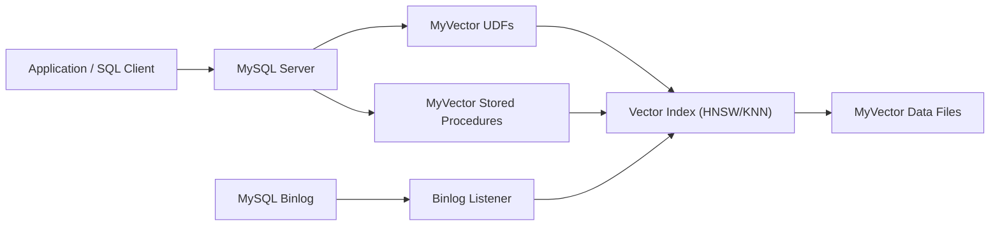

# MyVector


## MyVector: The native vector search plugin for MySQL

[](https://github.com/askdba/myvector/tags)
[](https://github.com/askdba/myvector/blob/main/LICENSE)
[](https://github.com/askdba/myvector/actions/workflows/ci.yml)
[](https://github.com/askdba/myvector/actions/workflows/docker-publish.yml)
[](https://github.com/askdba/myvector/pkgs/container/myvector)

[Why MyVector?](#-why-myvector) •
[Supported platforms](#-supported-platforms) •
[Quick Start](#-quick-start) •
[Features](#-features) •
[Usage](#-usage-examples) •
[Docker](#-docker) •
[Contributing](#-contributing) •
[Docs](#-documentation)

---

**MyVector** brings the power of vector similarity search directly to your MySQL
database. Built as a native plugin, it integrates seamlessly with your existing
infrastructure, allowing you to build powerful semantic search, recommendation
engines, and AI-powered applications without the need for external services.

It's fast, scalable, and designed for real-world use cases, from simple word
embeddings to complex image and audio analysis.

---

## 💻 Supported platforms

**Linux** (including the official Docker images on GHCR) and **macOS** are
supported for building and running MyVector. **Microsoft Windows is not a
supported build target at this time** — use Linux containers or a Unix-like
host for production builds and deployments. See `docs/BUILDING_MACOS.md` for
macOS notes.

---

## 🤔 Why MyVector?

<!-- markdownlint-disable MD013 -->
| Feature | MyVector | Other Solutions |
| :--- | :--- | :--- |
| **Deployment** | **Native MySQL Plugin:** No extra services to manage. | Often requires a separate, dedicated vector database. |
| **Data Sync** | **Real-time:** Automatic index updates via MySQL binlogs. | Manual data synchronization or complex ETL pipelines. |
| **Performance** | **Highly Optimized:** Built on the high-performance [HNSWlib](https://github.com/nmslib/hnswlib). | Performance varies; may require significant tuning. |
| **Ease of Use** | **Simple SQL Interface:** Use familiar SQL UDFs and procedures. | Custom APIs and query languages. |
| **Cost** | **Open Source:** Free to use and modify. | Can be expensive, especially at scale. |
| **Ecosystem** | **Leverage MySQL:** Use your existing tools, connectors, and expertise. | Requires a new ecosystem of tools and connectors. |
<!-- markdownlint-enable MD013 -->

---

## 🧭 Architecture



---

## 🚀 Quick Start

Get up and running with MyVector in minutes using our official Docker images.

### 1. Start the Docker Container

```bash
docker run -d \
  --name myvector-db \
  -p 3306:3306 \
  -e MYSQL_ROOT_PASSWORD=myvector \
  -e MYSQL_DATABASE=vectordb \
  ghcr.io/askdba/myvector:mysql-8.4
```

### 2. Connect to MySQL

```bash
mysql -h 127.0.0.1 -u root -pmyvector vectordb
```

### 3. Create a Table and Insert Data

Let's use a simple example with 50-dimensional word vectors.

```sql
-- Create a table for our word vectors
CREATE TABLE words50d (
  wordid INT PRIMARY KEY,
  word VARCHAR(50),
  wordvec VARBINARY(200) COMMENT 'MYVECTOR(type=HNSW,dim=50,size=100000,dist=L2)'
);

-- Download and insert the data (from the examples/stanford50d directory)
-- In a real-world scenario, you would generate your own vectors.
-- wget https://raw.githubusercontent.com/askdba/myvector/main/examples/stanford50d/insert50d.sql
-- mysql -h 127.0.0.1 -u root -pmyvector vectordb < insert50d.sql
```

### 4. Build the Vector Index

```sql
CALL mysql.myvector_index_build('vectordb.words50d.wordvec', 'wordid');
```

### 5. Run a Similarity Search

Find words similar to "school":

```sql
SET @school_vec = (SELECT wordvec FROM words50d WHERE word = 'school');

SELECT word, myvector_row_distance() as distance
FROM words50d
WHERE MYVECTOR_IS_ANN('vectordb.words50d.wordvec', 'wordid', @school_vec, 10);
```

You should see results like "university," "student," "teacher," etc. It's
that easy!

---

## ✨ Features

- **Approximate Nearest Neighbor (ANN) Search:** Blazing-fast similarity search
  using the HNSW algorithm.
- **Exact K-Nearest Neighbor (KNN) Search:** Brute-force search for 100% recall.
- **Multiple Distance Metrics:** L2 (Euclidean), Cosine, and Inner Product.
- **Real-time Index Updates:** Automatically keep your vector indexes in sync
  with your data using MySQL binlogs.
- **Persistent Indexes:** Save and load indexes to and from disk for fast
  restarts.
- **Native MySQL Integration:** Implemented as a standard MySQL plugin with
  User-Defined Functions (UDFs).

---

## 📖 Usage Examples

### Index Management

- **Build an Index:**

  ```sql
  CALL mysql.myvector_index_build('database.table.column', 'primary_key_column');
  ```

- **Check Index Status:**

  ```sql
  CALL mysql.myvector_index_status('database.table.column');
  ```

- **Drop an Index:**

  ```sql
  CALL mysql.myvector_index_drop('database.table.column');
  ```

- **Save and Load an Index:**

  ```sql
  -- Indexes are automatically saved. To load an index on startup:
  CALL mysql.myvector_index_load('database.table.column');
  ```

### Vector Functions

- **Create a Vector:**

  ```sql
  SET @my_vector = myvector_construct('[1.2, 3.4, 5.6]');
  ```

- **Calculate Distance:**

  ```sql
  SELECT myvector_distance(@vec1, @vec2, 'L2');
  ```

- **Display a Vector:**

  ```sql
  SELECT myvector_display(wordvec) FROM words50d LIMIT 1;
  ```

---

## 🐳 Docker

We provide official Docker images for various MySQL versions.

### Manual Plugin Installation

If you are running your own MySQL instance (not using the Docker images), install the plugin manually:

```bash
mysql -u root -p -e "INSTALL PLUGIN myvector SONAME 'myvector.so';"
mysql -u root -p < sql/install_functions.sql
```

> **Installation paths:**
> The **plugin** (`INSTALL PLUGIN`) is the current stable path and supports MySQL 8.0, 8.4, and 9.0.
> The **component** (`INSTALL COMPONENT`) is the forward path for MySQL 8.4 and 9.7 (LTS).
> MySQL 8.0 plugin support will be maintained through MySQL 8.0 EOL; no component build is planned for 8.0.

| Tag | MySQL Version |
| :--- | :--- |
| `ghcr.io/askdba/myvector:mysql-8.0` | 8.0.x |
| `ghcr.io/askdba/myvector:mysql-8.4` | 8.4.x (Recommended) |
| `ghcr.io/askdba/myvector:mysql-9.0` | 9.0.x |
| `ghcr.io/askdba/myvector:latest` | 8.4.x |

### Docker Compose

```yaml
version: '3.8'

services:
  myvector:
    image: ghcr.io/askdba/myvector:mysql-8.4
    ports:
      - "3306:3306"
    environment:
      MYSQL_ROOT_PASSWORD: myvector
      MYSQL_DATABASE: vectordb
    volumes:
      - myvector-data:/var/lib/mysql

volumes:
  myvector-data:
```

---

## 🤝 Contributing

We welcome contributions! Please see our [Contributing Guide](CONTRIBUTING.md) for
details on how to get started.

## 📚 Documentation

For more detailed information, please see the `docs` directory:

- [**DEMO.md**](docs/DEMO.md): A full demo with the Amazon Product Catalog
  dataset.
- [**ONLINE_INDEX_UPDATES.md**](docs/ONLINE_INDEX_UPDATES.md): How to create and
  configure real-time index updates via MySQL binlogs.
- [**CONFIGURATION.md**](docs/CONFIGURATION.md): Configuration file reference
  (options, defaults, validation, security).
- [**ANN_BENCHMARKS.md**](docs/ANN_BENCHMARKS.md): Performance benchmarks.
- [**DOCKER_IMAGES.md**](docs/DOCKER_IMAGES.md): More on using our Docker images.
- [**BUILDING_MACOS.md**](docs/BUILDING_MACOS.md): Building MySQL on macOS (Apple Silicon).
- [**CONTRIBUTING.md**](CONTRIBUTING.md): Our contribution guidelines.

---

## 🙏 Acknowledgments

- [**hnswlib**](https://github.com/nmslib/hnswlib): For the high-performance
  HNSW implementation.
- The **MySQL Community**: For creating a powerful and extensible database.

## 📄 License & Attribution

MyVector is licensed under the [GNU General Public License v2.0](LICENSE).

For information about third-party dependencies and their licenses, see:

- [NOTICE](NOTICE) - Third-party attribution notices
- [licenses/](licenses/) - Full license texts for all dependencies
