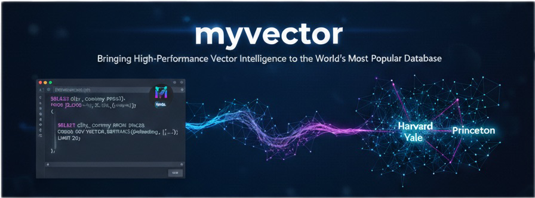
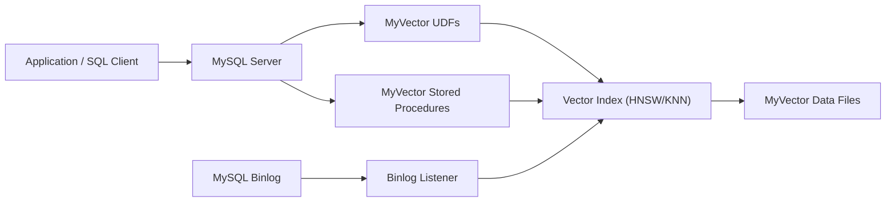

# MyVector

**MyVector** brings the power of vector similarity search directly to your MySQL
database. Built as a native plugin, it integrates seamlessly with your existing
infrastructure, allowing you to build powerful semantic search, recommendation
engines, and AI-powered applications without the need for external services.

It's fast, scalable, and designed for real-world use cases, from simple word
embeddings to complex image and audio analysis.

[Get Started :material-arrow-right:](quickstart.md){ .md-button .md-button--primary }
[View on GitHub :fontawesome-brands-github:](https://github.com/askdba/myvector){ .md-button }

---

## Supported platforms

**Linux** (including the official Docker images on GHCR) and **macOS** are
supported for building and running MyVector. **Microsoft Windows is not a
supported build target at this time** — use Linux containers or a Unix-like
host for production builds and deployments. See [Building on macOS](BUILDING_MACOS.md)
for macOS notes.

---

## Why MyVector?

| Feature | MyVector | Other Solutions |
| :--- | :--- | :--- |
| **Deployment** | **Native MySQL Plugin:** No extra services to manage. | Often requires a separate, dedicated vector database. |
| **Data Sync** | **Real-time:** Automatic index updates via MySQL binlogs. | Manual data synchronization or complex ETL pipelines. |
| **Performance** | **Highly Optimized:** Built on the high-performance [HNSWlib](https://github.com/nmslib/hnswlib). | Performance varies; may require significant tuning. |
| **Ease of Use** | **Simple SQL Interface:** Use familiar SQL UDFs and procedures. | Custom APIs and query languages. |
| **Cost** | **Open Source:** Free to use and modify. | Can be expensive, especially at scale. |
| **Ecosystem** | **Leverage MySQL:** Use your existing tools, connectors, and expertise. | Requires a new ecosystem of tools and connectors. |

---

## Architecture

---

## Features

- **Approximate Nearest Neighbor (ANN) Search:** Blazing-fast similarity search
  using the HNSW algorithm.
- **Exact K-Nearest Neighbor (KNN) Search:** Brute-force search for 100% recall.
- **Multiple Distance Metrics:** L2 (Euclidean), Cosine, and Inner Product.
- **Real-time Index Updates:** Automatically keep your vector indexes in sync
  with your data using MySQL binlogs.
- **Persistent Indexes:** Save and load indexes to and from disk for fast
  restarts.
- **Native MySQL Integration:** Implemented as a standard MySQL plugin with
  User-Defined Functions (UDFs).

---

## Acknowledgments

- [**hnswlib**](https://github.com/nmslib/hnswlib): For the high-performance
  HNSW implementation.
- The **MySQL Community**: For creating a powerful and extensible database.

## License

MyVector is licensed under the [GNU General Public License v2.0](https://github.com/askdba/myvector/blob/main/LICENSE).

For information about third-party dependencies and their licenses, see the
[NOTICE](https://github.com/askdba/myvector/blob/main/NOTICE) file and the
[licenses/](https://github.com/askdba/myvector/tree/main/licenses) directory
in the repository.
